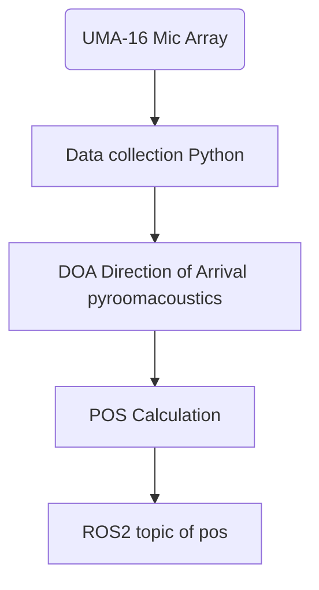

```mermaid
graph TB
    Start(UMA-16 Mic Array) --> Data[Data collection Python]
    Data--> DOA[DOA Direction of Arrival pyroomacoustics]
    DOA--> POS[POS Calculation]
    POS --> ROS[ROS2 topic of pos]
    
        

```

